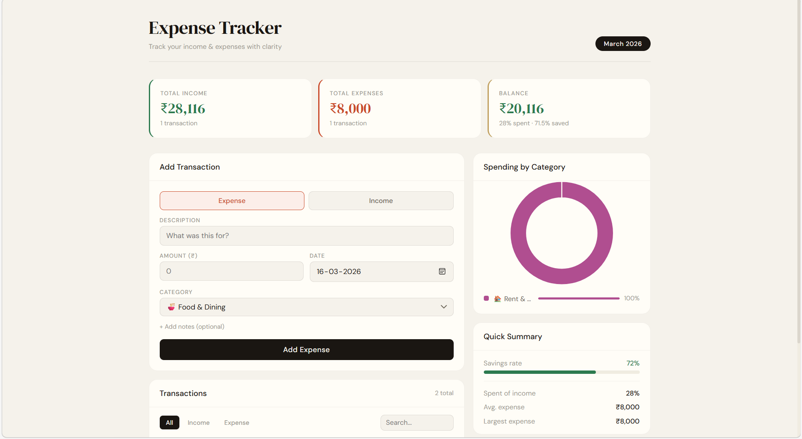

# 💰 Expense Tracker — Full Stack

A full-stack Expense Tracker app built with **Spring Boot (Java)** + **React**.  
Track income and expenses, visualize spending by category, and manage transactions via a clean REST API.

---
## 📸 Screenshot
<!-- Add a screenshot after deploying -->

## 🗂 Project Structure

```
expense-tracker/
├── backend/                   ← Spring Boot REST API
│   ├── pom.xml
│   └── src/
│       └── main/
│           ├── java/com/expensetracker/
│           │   ├── ExpenseTrackerApplication.java
│           │   ├── config/        CorsConfig.java
│           │   ├── controller/    TransactionController.java
│           │   ├── dto/           ApiResponse, SummaryDTO, TransactionRequestDTO, TransactionResponseDTO
│           │   ├── exception/     GlobalExceptionHandler, ResourceNotFoundException
│           │   ├── model/         Transaction.java, TransactionType.java
│           │   ├── repository/    TransactionRepository.java
│           │   └── service/       TransactionService.java, TransactionServiceImpl.java
│           └── resources/
│               └── application.properties
│
└── frontend/                  ← React App
    ├── package.json
    └── src/
        ├── App.js / App.module.css
        ├── index.js / index.css
        ├── components/
        │   ├── SummaryCards.js      (income / expense / balance cards)
        │   ├── TransactionForm.js   (add transaction form)
        │   ├── TransactionList.js   (filterable list with delete)
        │   ├── SpendingChart.js     (doughnut chart by category)
        │   └── QuickStats.js        (savings rate, avg expense, etc.)
        ├── hooks/
        │   ├── useSummary.js
        │   └── useTransactions.js
        ├── services/
        │   └── api.js              (axios API calls)
        └── utils/
            └── constants.js        (categories, formatters)
```

---

##  Prerequisites

Make sure you have installed:

| Tool | Version | Download |
|------|---------|----------|
| Java JDK | 17+ | https://adoptium.net |
| Maven | 3.8+ | https://maven.apache.org |
| Node.js | 18+ | https://nodejs.org |
| MySQL | 8.0+ | https://dev.mysql.com/downloads |

Verify installations:
```bash
java -version
mvn -version
node -version
npm -version
mysql --version
```


##  Step 1 — Set Up MySQL Database

Open MySQL and run:

```sql
CREATE DATABASE expense_tracker_db;
CREATE USER 'root'@'localhost' IDENTIFIED BY 'root';
GRANT ALL PRIVILEGES ON expense_tracker_db.* TO 'root'@'localhost';
FLUSH PRIVILEGES;
```

> **Note:** If your MySQL already has a `root` user with a different password, update  
> `backend/src/main/resources/application.properties`:
> ```properties
> spring.datasource.username=root
> spring.datasource.password=YOUR_PASSWORD
> ```

Spring Boot will **auto-create the tables** on first run (via `ddl-auto=update`).

---

##  Step 2 — Run the Backend (Spring Boot)

```bash
# Navigate to backend folder
cd expense-tracker/backend

# Build and run
mvn spring-boot:run
```

Or build a JAR and run it:
```bash
mvn clean package -DskipTests
java -jar target/expense-tracker-backend-1.0.0.jar
```

The API will start at: **http://localhost:8080**

### Verify it's running:
```bash
curl http://localhost:8080/api/transactions/summary
```
Expected response:
```json
{
  "success": true,
  "message": "Summary fetched",
  "data": {
    "totalIncome": 0,
    "totalExpense": 0,
    "balance": 0,
    ...
  }
}
```

---

##  Step 3 — Run the Frontend (React)

Open a **new terminal window**:

```bash
# Navigate to frontend folder
cd expense-tracker/frontend

# Install dependencies (first time only)
npm install

# Start the development server
npm start
```

The app will open at: **http://localhost:3000**

The React app proxies `/api` requests to `http://localhost:8080` (configured in `package.json`).

---

##  REST API Reference

Base URL: `http://localhost:8080/api`

| Method | Endpoint | Description |
|--------|----------|-------------|
| `GET` | `/transactions` | Get all transactions |
| `GET` | `/transactions?type=EXPENSE` | Filter by type (INCOME / EXPENSE) |
| `GET` | `/transactions?search=salary` | Search by description |
| `GET` | `/transactions?startDate=2024-03-01&endDate=2024-03-31` | Filter by date range |
| `GET` | `/transactions/{id}` | Get transaction by ID |
| `POST` | `/transactions` | Create a new transaction |
| `PUT` | `/transactions/{id}` | Update a transaction |
| `DELETE` | `/transactions/{id}` | Delete a transaction |
| `GET` | `/transactions/summary` | Get income/expense summary |

### Example: Create a Transaction
```bash
curl -X POST http://localhost:8080/api/transactions \
  -H "Content-Type: application/json" \
  -d '{
    "description": "Monthly Salary",
    "amount": 75000,
    "type": "INCOME",
    "category": "salary",
    "date": "2024-03-01",
    "notes": "March salary"
  }'
```

### Example: Get Summary
```bash
curl http://localhost:8080/api/transactions/summary
```

---

##  Running Tests

```bash
cd backend
mvn test
```

Tests use an in-memory H2 database — no MySQL required for tests.

---

##  Tech Stack

### Backend
| Technology | Purpose |
|-----------|---------|
| Spring Boot 3.2 | Application framework |
| Spring Data JPA | Database ORM |
| Spring Validation | Input validation |
| MySQL 8 | Database |
| Lombok | Boilerplate reduction |
| JUnit 5 + Mockito | Unit testing |

### Frontend
| Technology | Purpose |
|-----------|---------|
| React 18 | UI framework |
| Axios | HTTP client |
| Chart.js + react-chartjs-2 | Doughnut chart |
| react-hot-toast | Notifications |
| CSS Modules | Scoped styling |

---

##  Configuration Reference

`backend/src/main/resources/application.properties`:

```properties
# Change DB credentials as needed
spring.datasource.url=jdbc:mysql://localhost:3306/expense_tracker_db?createDatabaseIfNotExist=true
spring.datasource.username=root
spring.datasource.password=root

# Server port (default 8080)
server.port=8080

# Auto creates/updates tables
spring.jpa.hibernate.ddl-auto=update
```

---

##  Common Issues

| Problem | Fix |
|---------|-----|
| `Access denied for user 'root'` | Update DB password in `application.properties` |
| `Port 8080 already in use` | Change `server.port=8081` or kill the process using that port |
| `npm install` fails | Delete `node_modules/` and `package-lock.json`, then retry |
| CORS errors in browser | Ensure backend is running on port 8080 and frontend on 3000 |
| Tables not created | Set `spring.jpa.hibernate.ddl-auto=create` once, then change back to `update` |

---

##  Resume Points

When describing this project on your resume, highlight:

- **Built a full-stack expense tracking application** using Spring Boot REST API and React
- **Designed RESTful endpoints** with proper HTTP methods, status codes, and error handling
- **Used Spring Data JPA** with custom JPQL queries for aggregations and filtering
- **Implemented global exception handling** with `@RestControllerAdvice`
- **Applied separation of concerns** via Controller → Service → Repository layers
- **Used DTOs** to decouple API contracts from JPA entities
- **Wrote unit tests** with JUnit 5 and Mockito achieving service layer coverage
- **Integrated Chart.js** for real-time spending visualizations
- **Configured CORS** for cross-origin frontend-backend communication
